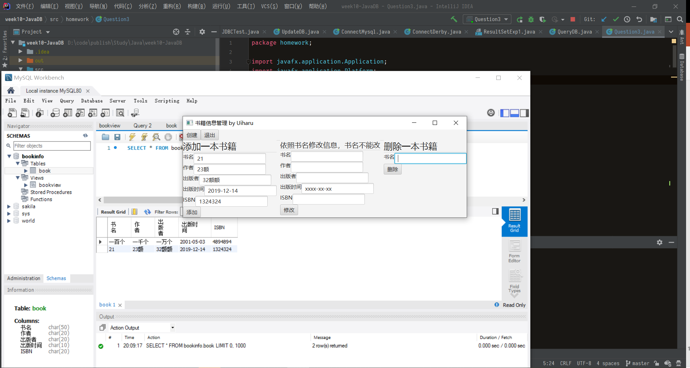

# 十一周作业

## 第一题

    1. SQL语言包括哪几类基本语句来完成数据库的基本操作？ 

SQL语言包括以下6种基本语句来完成数据库的基本操作：

1. select语句：用来对数据库进行查询并返回符合用户查询标准的结果数据。
2. create table语句：用来建立新的数据表。
3. insert语句：向数据表中插入或添加新的数据行。
4. update语句：更新或修改符合规定条件的记录。
5. delete语句：删除数据表中的行或记录。
6. drop table语句：删除某个数据表以及该表中的所有记录

## 第二题

    2. 归纳一下使用JDBC进行数据库连接的完整过程。 

1. 加载驱动
2. 与数据库建立连接
3. 发送SQL语句
4. 处理语句的执行结果
5. 关闭连接

## 第三题

    3. 建立mydb数据库存储管理书籍信息，包括：书名、作者、出版者、出版时间和ISBN。编写一个JavaFX应用程序，在数据库中建立数据表book和视图 bookview（基于book中ISBN,书名，作者），设计适当窗口界面实现对表中数据增、删、改功能。 

如源代码中的Question3.java所示，一切错误信息输出于控制台中。  
第一次使用该程序需要点击顶端的创建按钮，会新建一个名为bookinfo的数据库。以后再次点击该按钮，数据库将不会被重复创建。  
点击退出按钮，连接才会被正确结束。close方法是在点击退出按钮的时候被调用的

## 第四题

    4. 将本章示例程序中的 QueryDB 升级改版为JavaFX用户接口。

如源代码中的Question4.java所示，未对数据库操作部分进行修改。  
为了和原来的程序保持一致，我没有关闭对数据库的连接，即没有调用con.close()。我觉得这样不好，但是源程序就没调用。

## 备注

三四两题，均在本地测试成功。但第四题并没有使用真实数据进行调试，整体上没问题，按下提交按钮能正常输出错误信息（即找不到储存信息的表）  
展示一个第三题的演示
