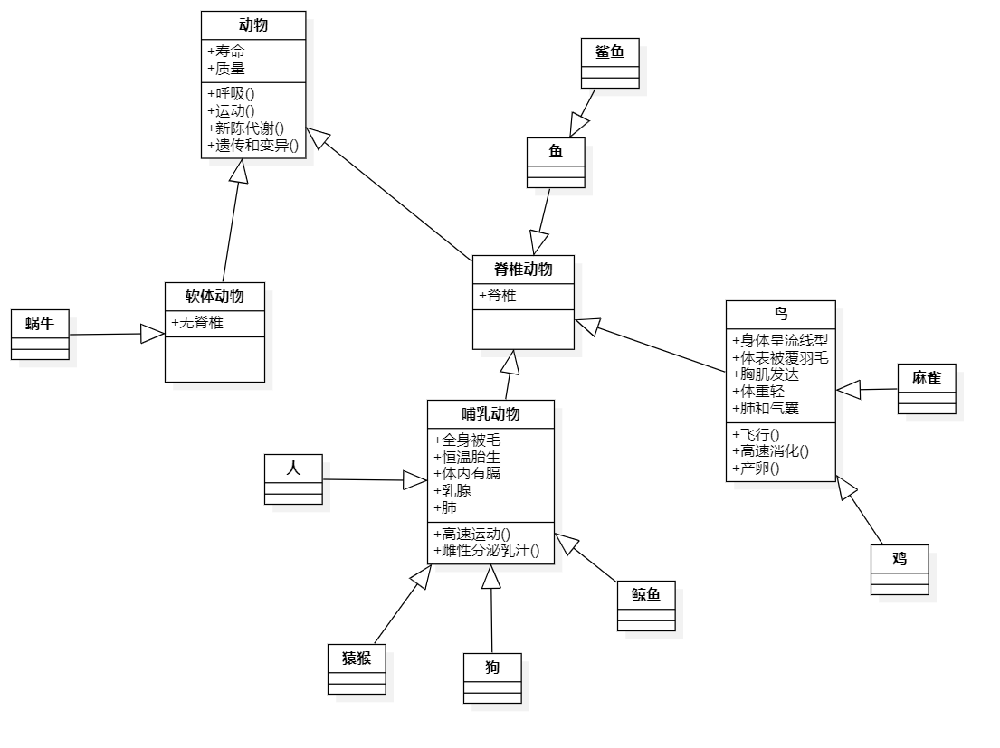

# 第四周作业

## 第一题

    什么是面向对象程序设计？与面向过程程序设计的区别？主要优点有哪些？

### 第一问

面向对象程序设计是一种用人们**通常的思维方式**来建立问题模型的程序设计方式。人们引入“对象”这一概念来表现事物并建立问题的模型。 面向对象是一种**对现实世界理解和抽象的方法**。  
面向对象的程序设计就是**使用类和对象以及面向对象特有的概念进行编程**

### 第二问  

面向对象与面向过程设计的区别在于编程思想方面的区别。  

面向过程设计是一种**以过程为中心**的解决问题方案，通过一个个步骤的执行达成目标，在程序中就是设计函数模块来解决问题。比如要排序一个数组，面向过程的方式是函数+数据。比如在C中，要返回一个字符串的长度，string.h提供了strlen方法。
>extern unsigned int strlen(char *s) //strlen把数据放进函数里返回长度，这是面向过程的做法。

而在面向对象的设计理念中，数组是一个类，其长度是类的一个属性（虽然并不能直接获得），可以通过成员函数计算出来。比如：
>arr.length()

### 第三问

面向对象程序设计的优点很多，我认为最重要的一点是OOP易于理解。虽然对于初学者来说（比如我）第一次搞懂对象的概念可能比较困难，相比之下，理解面向过程一步步的解决问题反而更为自然。回想一下其实能发现，面向对象是一种更**正常**的思维方式。在生活中，人不同于机械，很少会用同一套范式处理不同的问题，而是具体问题具体分析。  
在实际编程方面，OOP的好处体现在其方式设计的程序易于维护和修改，且模块化程度大大提高，使得代码的重用率提高，减小重复工作量。同时易于拓展，可以方便的开发新功能。  
OOP还有如下特性:

* 封装性：将对象的私有数据与公共数据分离开，增强程序的稳定性，防止过程中数据的不当修改导致程序发生未知错误。同时这种方式**将数据与操作结合**，解决了面向过程设计中的一些问题。当然，由于这种封装性，类如同一个黑匣子，程序员可以在不知道其内部运行机制的情况下使用类。

* 自治性：每个对象都是一个独立的整体，可以**根据自身定义的操作**管理自己。而在一个对象想要影响其他对象时，也不能直接操作，而需要调用另一个对象的接口函数（即**消息**）。

* 安全性：封装性已经很能体现类的安全性了。

* 拓展性：可拓展性是类的一个重要特征，主要体现在其继承和多态等方面。类的拓展性使得程序员可以更方便的为项目添加新功能，而不用重写现有的代码。

## 第二题

    简述抽象与封装、继承与多态性等的概念。

### 抽象

抽象是设计程序时运用的一种重要方法。要求程序员去除掉分析对象的**次要部分**，而保留其**本质特征**，以达到将数据或者过程对象化的目的。

### 封装

封装是将抽象出的数据类型，以及基于这些数据的操作（方法）结合，绑定的操作。数据在封装后就被**保护**在了抽象数据类型的内部。

### 继承

继承是两个类之间的关系，一个类可以从另一个类中获得其原有的数据和方法。类可以进行多级继承，在继承的过程中，代码被多次使用，减少了工作量。

### 多态性

我觉得多态性的概念十分复杂，简而言之就是**同名的方法**在**不同情况下**被智能调用。目前我了解的多态性的体现有通过参数重载同名方法，以及重写父类的同名方法两个方面。

## 第三题

    什么叫对象？什么叫类？举例说明类和对象有什么关系。类与C语言中的类型有何不同？ 

## 第一问

广义上说，**现实世界的一切事物**都是对象，对于程序设计来说，对象是**属性**（成员变量，或域）和**方法**（成员函数）的集合。

## 第二问

类是具体对象的模型，是描述对象的**基本原型**，对象是类的实例。类和对象就像图纸和成品的关系。拿现实世界的东西打比方的话，比如某一型号的手机是一个类，这个类可以定义不同颜色，不同ROM,RAM大小的手机，这些手机虽然可能有不一样之处，但都拥有定义在类中的共性，比如SOC相同，相机模组相同等。

## 第三问

C++中的结构基本上和类是相同的，甚至有继承的特性，比如这样一段代码：

    struct A
    {
    int x;
        int y;
    };
    struct B:public A
    {
        int z;
        B(int xx, int yy, int zz) {
            x = xx; y = yy; z = zz;
        }
    };

在C++中是完全成立的。但是在C中，结构体里不能有方法，也没有继承等OOP的特性，这就是C的结构与Java类的区别。

## 第四题

    Java程序使用的类分为哪两大类？举例说明。

### 系统定义的类

例子

>具有各种功能的System类  
处理字符串的StringBuilder类  
处理数组的Array类

### 用户定义的类

例子：bird类

    public static class Bird{  
    public void fly(){ 
    System.out.println("我会飞");  
            }  
        }  
    }

## 第五题

    什么是访问控制符？有哪些访问控制符？哪些可以用来修饰类？哪些用来修饰域和方法？

### 第一问

访问控制符是**用于控制其他类对某一类的访问权限**的修饰符。

### 第二、三、四问

有public 、protected 、private三种访问控制符，当然，如果什么都不加，也算一种访问控制符。我觉得这三种修饰符都可以用来修饰类，域（成员变量），和方法。

## 第六题

    根据常识建立类继承结构图：动物、鱼、狗、鲨鱼、猿猴、人、软体动物、鸟、哺乳动物、鸡、麻雀、脊椎动物、鲸鱼、蜗牛。并为其中鸟类设计状态与行为。 

使用Staruml创建，源文件已附上

## 第七题

    编程实现计算正方形、三角形、矩形及圆形面积计算功能。

    要求：
    
    1）定义两个包，所有类几何形体类定义shape包中，含main()方法的类定义在app中  
    
    2）在定义抽象类Shape,在其中定义area()方法计算并输出图形面积；定义正方形、三角形、矩形及圆形类继承Shape类，实现各自的面积计算，其中长、宽、高、半径等基本几何要素设为private；定义各类必要的构造方法及其它辅助方法

    3）实现使用静态成员变量来计算内存中的实例化的各几何图形对象数目。

见week3项目的源代码（github上的week数比我实际学习的日期少一周）  
附上含有main函数的部分  
实现了输出形状名称与面积的功能

    package app;

    import shape.*;

    public class App {
        static void print_area(Shape s){
            System.out.println(s.name()+"的面积为"+s.area());
        }
        public static void main(String[] args) {
            Round cir=new Round(3);
            Rectangle rec=new Rectangle(5,6);
            Square squ=new Square(5);
            Triangle tri=new Triangle(3,4);
            System.out.println("一共初始化了"+Round.times+"个属于Shape抽象类的对象");
            print_area(cir);
            print_area(rec);
            print_area(squ);
            print_area(tri);
        }
    }
