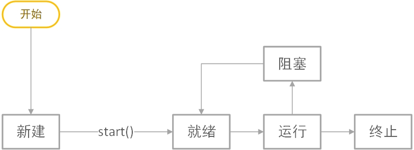

# 第八次作业

## 第一题

    1. Java为什么要引入线程机制，说明程序和进程、线程之间的关系。

（1）线程又比进程的通信更简单，切换更快，补充了进程缺少的功能，所以java引入了线程机制  
（2）进程是程序的一次动态执行过程，它对应了从代码加载、执行到执行完毕的一个完整过程。程序可以被多次加载到系统的不同内存区域分别执行，形成不同的进程。  
（3）线程是进程内部的一个顺序执行控制流。一个进程在执行过程中，可以产生多个线程同时执行。因为不同进程的内存数据和状态是独立的，他们之间相互通信的成本较大，而一个程序内的多个线程则共享这些信息，通信相对来说比较容易。  
（4）简而言之，程序是进程的执行过程，线程是进程中不同的执行路径。

## 第二题

    2. Java平台支持哪几种方式的多线程编程，各有何特点？

1. 定义一个类，实现Runnable接口，并实现接口的run方法。之后用实现了接口的对象作为参数实例化一个Thread对象，调用其start方法即可。这种方法的特点是仅实现了接口，自定义的类还可以作为其他类的子类。

2. 使用一个子类继承Thread类，重写run方法。之后调用子类对象的start方法。特点是继承了Thread类，由于Java不允许多继承，就不能继承其他类了。

3. 实现Callable接口。特点是在任务结束时会提供返回值，而前两个没有。Callable属于Executor框架，功能较前两种更为强大。

## 第三题

    3. 线程有哪几种基本状态，绘图描述它们之间的转换条件。

共有五种基本状态：
新建(Newborn)、
就绪(Runnable)、
运行(Running)、
阻塞(Blocked)、
终止(Finished)  

## 第四题

    4.设计实现JavaFX程序演示多线程执行情况。可使用若干标签或按钮对象代表不同线程，在程序窗口从左到右移动模拟线程的执行进度，标签或按钮显示线程名，执行状态与其它状态以不同颜色表示，设置开关按钮控制所有线程的“执行”及“暂停”。

如代码所示，十分感谢老师的宽限...  
演示两个截图  
  

